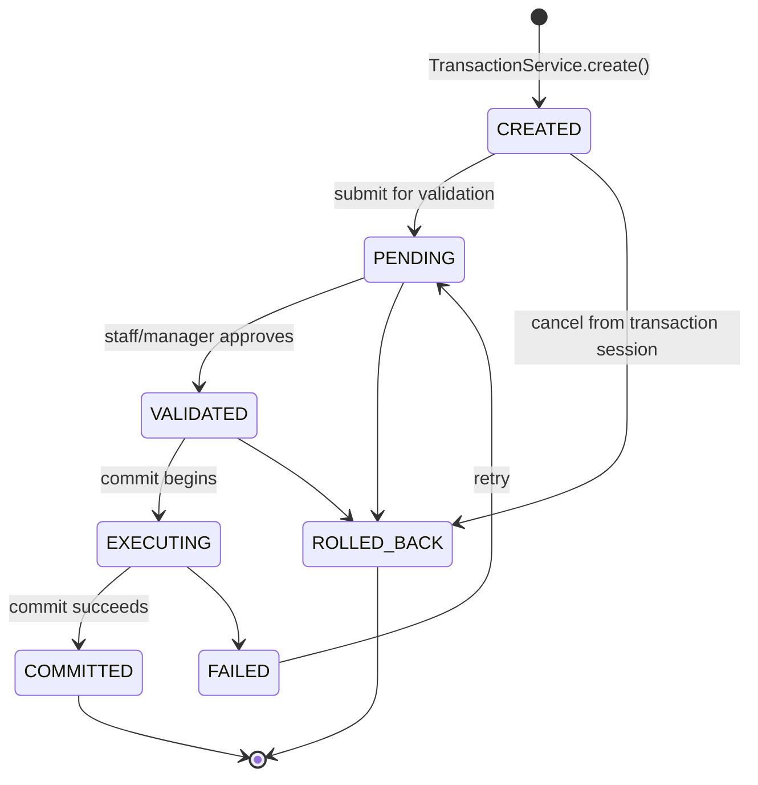

# Transaction Platform

A Django app for tracking allocation of shared database/infra-style resources — compute, storage, network, that kind of thing — through a proper request → validate → commit lifecycle, with an audit trail so you can always answer "who allocated what, when, and why did it fail."

The domain model is built around `DatabaseResource` (an allocatable pool of capacity) and `DatabaseTransaction` (a request against that pool), tracked with `capacity_units`/`allocated_units` and a full audit trail. Migration history lives in a single clean `dashboard/migrations/0001_initial.py` reflecting the current schema directly.

## What it actually does

- A **manager** (superuser) or **staff** account registers a `DatabaseResource` — say, a Compute node with 64 vCPU of capacity.
- A **requester** picks a resource and a number of units and submits it. That reserves capacity against the resource immediately (`allocated_units` goes up, `available_units` goes down) — it doesn't wait for approval to hold the capacity, same as how a cloud reservation blocks off capacity the moment you ask for it, not when someone gets around to approving it.
- The request then moves through a fixed set of states — `CREATED → PENDING → VALIDATED → EXECUTING → COMMITTED`, with `ROLLED_BACK` and `FAILED` as exits along the way — and a staff/manager account has to validate it before it can be committed.
- Every state change gets written to a `TransactionAudit` row: from-state, to-state, who did it, when, and an optional note. Nothing about the lifecycle is inferred after the fact from timestamps on the transaction itself — the audit log is the source of truth for "what happened."
- If a request gets rolled back instead of committed, the reserved capacity goes back to the resource. Committing doesn't free anything further — the reservation just becomes permanent.

## The state machine

This is the part I actually care about in this project, so it's worth being explicit about instead of leaving it implicit in a bunch of `if` statements scattered across views.



The actual transition table lives in one place — `ALLOWED_TRANSITIONS` in [`dashboard/services.py`](dashboard/services.py) — and every state change in the app, no matter which view triggers it, goes through `TransactionService.transition()`, which checks that dict before doing anything. I did this specifically so a bug in one view can't accidentally let a transaction skip a state that some other part of the app assumes it went through. If you try an illegal jump (say, moving a `COMMITTED` transaction back to `PENDING`), you get an `InvalidTransitionError` and a flash message, not a corrupted row.

## Why `select_for_update()` is in there

`TransactionService.create/rollback/commit` all lock the resource row with `select_for_update()` before reading or writing its capacity numbers. The reason is the obvious one: two people hitting "allocate" on the same resource at roughly the same time shouldn't both be able to read "40 units available" and both go ahead and take 30, leaving the resource at -20.

Honest caveat, because I'd rather say this than have someone else find it: **on SQLite** (what this runs on locally), `select_for_update()` doesn't actually do row-level locking — SQLite doesn't have that concept, and the call is effectively a no-op for locking purposes. What actually prevents the race locally is SQLite's own whole-database write lock, which is a blunter instrument but happens to produce the same result for a single-resource contention case. On Postgres or MySQL/InnoDB, which is where this would actually need to hold up, `select_for_update()` does provide the real row-level guarantee. I haven't set up a Postgres-backed test run to prove that directly yet — it's on the list, not done.

## The two-app thing (dashboard vs staff)

You'll notice `dashboard/views.py` and `staff/views.py` have near-identical `resource_list`, `resource_update`, `resource_delete`, and `transaction_list` functions. That's not intentional architecture, it's leftover duplication from before the rename, and I know it should get collapsed into one implementation with role-based branching instead of two copies that both need to be kept in sync by hand (I already found and fixed the same missing-authorization-decorator bug in both copies once — that's exactly the kind of thing duplication causes). Flagging it here instead of pretending it's fine.

## Project layout

```
inventory/     project settings, root urlconf
dashboard/     the actual domain: DatabaseResource, DatabaseTransaction, TransactionAudit,
               TransactionService (state machine), analytics.py (dashboard metrics)
staff/         staff-facing views — registration/activation workflow + a
               near-duplicate of the dashboard resource/transaction views (see above)
user/          auth, profile, Google OAuth login
```

## Running it

```powershell
python -m venv venv
.\venv\Scripts\Activate.ps1
pip install -r requirements.txt
```

Copy `.env.example` to `.env` and fill in `DJANGO_SECRET_KEY` at minimum (generate one with `python -c "import secrets; print(secrets.token_urlsafe(64))"`). Everything else in there — Gmail app password, Google OAuth client, Gemini API key — is optional; the app runs fine without them, you just don't get staff-activation emails, "Sign in with Google," or the AI insights page.

```powershell
python manage.py migrate
python manage.py createsuperuser
npm install
npm run build:css
python manage.py runserver
```

## Tests

```powershell
python manage.py test
```

Covers the models, the state machine (including the "can't skip states" and "failed transactions can retry" cases), the auth decorators (anonymous → redirect, wrong role → 403, right role → allowed), the analytics aggregations, and the resource/transaction CRUD flows. I don't have a real cross-thread concurrency test proving the locking claim above yet — that's a harder test to write correctly against SQLite's in-memory test database than it looks, and I'd rather not ship one that looks like it proves something it doesn't.

## What's not done

- `dashboard`/`staff` duplication (see above)
- `is_staff` is being used as "is this person a clerk," which isn't really what Django's `is_staff` flag is for (it also controls admin-site access) — should be a proper role field or Groups/Permissions instead
- No pagination on the resource/transaction list pages — fine for a handful of rows, would fall over with real data
- SQLite only; never run against Postgres, so the `select_for_update()` claim above is unverified under the backend where it'd actually matter
